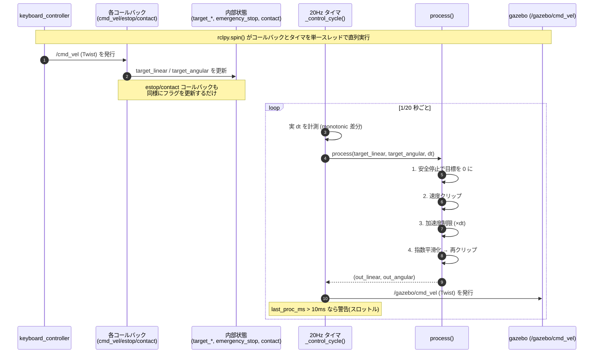

# Control Logic（制御ロジックノード）

ユーザーからの生のコマンド `/cmd_vel` を購読し、**安全制約パイプライン**を適用した
うえで、安全化した結果を `/gazebo/cmd_vel` へ再発行してシミュレータに渡すノードです。

- **ノード名:** `control_logic`
- **購読（Subscribe）:**
  - `/cmd_vel` (`geometry_msgs/msg/Twist`) — 生の速度コマンド
  - `/emergency_stop` (`std_msgs/msg/Bool`) — 非常停止（任意）
  - `/contact` (`std_msgs/msg/Bool`) — 接触/衝突検知（任意、既定で有効）
- **発行（Publish）:** `/gazebo/cmd_vel` (`geometry_msgs/msg/Twist`)
- **制御レート:** 20 Hz / 1 周期あたりの処理時間 < 10 ms

---

## 制約パイプライン（適用順）

`process()` 内で、以下の順に1周期分の処理を行います。

1. **安全ルール（最優先）** — 非常停止 or 接触検知が立っていれば、目標速度を
   強制的に 0 に上書きします。
   - **非常停止** — `/emergency_stop` (`std_msgs/msg/Bool`)
   - **接触停止（任意）** — `/contact` (`std_msgs/msg/Bool`)。バンパー/衝突センサ
     などを想定。既定で有効、`--no-contact-stop` で無効化。
2. **速度制限（clip）** — `linear.x` / `angular.z` を `max_linear_speed`(2.0 m/s) /
   `max_angular_speed`(2.0 rad/s) にクリップ。クリップは本来あってはならない制約
   違反なので、ログに出します（1 秒に 1 回までスロットル）。
3. **加速度制限（rate limit）** — 1 周期あたりの変化量を `max_accel`(1.0 m/s²) /
   `max_angular_accel`(1.0 rad/s²) × `dt` に制限。通常の平滑化なので毎周期の
   ログは出しません。
4. **指数平滑化（ローパスフィルタ）** — `alpha = 0.3` の指数移動平均でジッタを除去。

最後に、フィルタ後の値を**もう一度クリップ**して安全側に倒します（防御的処置）。

> **補足:** 加速度制限と指数平滑化が直列に適用されるため、ステップ状のコマンドは
> 加速度制限だけの場合よりも緩やかに目標へ近づきます（平滑化による追従遅れ）。
> ただし最終的には指令値へ正確に収束し、設定した加速度を超えることはありません。
> スムーズで安全なデモのための意図的な挙動です。

---

## シーケンス図

ROS 2 のコールバックとタイマは `rclpy.spin()` により**単一スレッド**で直列実行
されます。`/cmd_vel` などのコールバックは最新値を保持するだけで、実際の計算と
発行は 20 Hz のタイマ（`_control_cycle`）が担います。



シャットダウン時（Ctrl+C 等）は `spin()` の `finally` で `_publish_stop()` を呼び、
ゼロ速度を 1 回発行してからノードを破棄するため、最後の指令で走り続けません。

---

## 関数リファレンス

### モジュール関数

#### `clip(value, limit)`
値を対称区間 `[-limit, +limit]` に収めます。

| 引数 | 型 | 説明 |
|------|----|------|
| `value` | float | 制限したい値 |
| `limit` | float | 上限の絶対値（非負を想定） |

**戻り値:** クリップ後の float。

#### `rate_limit(target, current, max_delta)`
`current` から `target` への変化量を `max_delta` 以内に制限します（加速度制限の核）。

| 引数 | 型 | 説明 |
|------|----|------|
| `target` | float | 目標値 |
| `current` | float | 現在値 |
| `max_delta` | float | 1 周期で許容する最大変化量（= 加速度 × dt） |

**戻り値:** 変化量を制限した次の値。差が `max_delta` 以内なら `target` をそのまま返す。

---

### `ControlLogic` クラス

速度コマンドに安全制約と平滑化を適用するメインクラス。

#### `__init__(...)`
ノード・パブリッシャ・サブスクライバを構築し、内部状態を初期化します。
`dry_run` 時は ROS を一切初期化しません（`process()` を直接呼ぶテスト用）。

| 引数 | 型 | 既定値 | 説明 |
|------|----|--------|------|
| `max_linear_speed` | float | 2.0 | 直進速度の上限 [m/s] |
| `max_angular_speed` | float | 2.0 | 旋回速度の上限 [rad/s] |
| `max_accel` | float | 1.0 | 直進加速度の上限 [m/s²] |
| `max_angular_accel` | float | 1.0 | 旋回加速度の上限 [rad/s²] |
| `alpha` | float | 0.3 | 指数平滑化係数（0〜1。大きいほど追従が速い） |
| `control_rate_hz` | float | 20.0 | 制御レート [Hz]。`dt = 1/control_rate_hz` |
| `enable_contact_stop` | bool | True | 接触停止（`/contact`）を有効にするか |
| `use_sim_time` | bool | False | Gazebo の `/clock` に追従（rclpy `use_sim_time`） |
| `dry_run` | bool | False | ROS なしで動作（ローカルテスト用） |

#### コールバック

| 関数 | 引数 | 説明 |
|------|------|------|
| `cmd_vel_callback(msg)` | `msg`: `Twist` | 最新の生コマンドを `target_linear/target_angular` に保存するだけ |
| `estop_callback(msg)` | `msg`: `Bool` | `emergency_stop` フラグを更新（状態変化時のみログ） |
| `contact_callback(msg)` | `msg`: `Bool` | `contact` フラグを更新（状態変化時のみログ） |

#### `_log_throttled(category, message)`
カテゴリ単位で、`_log_interval`（1 秒）に 1 回までしか出力しないログ。連続クリップ/
ランプ時のログ洪水（=レイテンシ予算の圧迫）を防ぎます。

| 引数 | 型 | 説明 |
|------|----|------|
| `category` | str | スロットルの単位となるキー（例 `"clip_linear"`） |
| `message` | str | 出力する文字列 |

#### `process(target_linear, target_angular, dt=None)` ★中核
1 周期分の制約パイプラインを実行します。ROS 非依存なので**単体テストで直接呼べます**。

| 引数 | 型 | 既定値 | 説明 |
|------|----|--------|------|
| `target_linear` | float | — | 目標直進速度 [m/s] |
| `target_angular` | float | — | 目標旋回速度 [rad/s] |
| `dt` | float | None | 前回からの経過時間 [s]。省略時は公称 `1/control_rate_hz`。`[1e-4, 10×公称]` にクランプ |

**戻り値:** `(out_linear, out_angular)` のタプル。あわせて `cur_*`/`filt_*`/`last_proc_ms`
を更新します。

#### 発行・制御ループ

| 関数 | 引数 | 説明 |
|------|------|------|
| `_publish(linear, angular)` | float, float | `Twist` を組み立てて `/gazebo/cmd_vel` に発行（dry-run 時は何もしない） |
| `_publish_stop()` | なし | 状態を 0 にしてゼロ速度を 1 回発行（停止用） |
| `_control_cycle()` | なし | 20 Hz タイマのコールバック。実 dt を計測 → `process()` → `_publish()`。10 ms 超過時に警告 |
| `spin()` | なし | タイマを生成し `rclpy.spin()` で駆動。終了時に停止コマンドを送りノードを破棄 |

---

### CLI 用関数

#### `parse_args(argv=None)`
コマンドライン引数を解釈します。`--ros-args ...`（ROS 2 が注入する引数）は
`remove_ros_args` で除去してから解釈し、未知の引数は警告します。

| 引数（CLI） | 既定値 | 説明 |
|-------------|--------|------|
| `--max-linear` | 2.0 | `max_linear_speed` |
| `--max-angular` | 2.0 | `max_angular_speed` |
| `--max-accel` | 1.0 | `max_accel` |
| `--max-angular-accel` | 1.0 | `max_angular_accel` |
| `--alpha` | 0.3 | 指数平滑化係数 |
| `--rate` | 20.0 | 制御レート [Hz] |
| `--no-contact-stop` | （無効化フラグ） | 接触停止を無効化 |
| `--use-sim-time` | （フラグ） | `/clock` に追従 |
| `--dry-run` | （フラグ） | ROS なしで起動 |

#### `main(argv=None)`
`parse_args()` → `ControlLogic(...)` 構築 → `spin()` を呼ぶエントリポイント。

---

## 使い方

```bash
# 通常起動（ROS 2 はマスターレス。roscore 不要）
python3 control.py

# パラメータ調整
python3 control.py --max-linear 2.0 --max-angular 2.0 \
    --max-accel 1.0 --max-angular-accel 1.0 --alpha 0.3 --rate 20

# Gazebo の sim-time に追従
python3 control.py --use-sim-time

# ROS なしのローカルテスト（process() を直接利用）
python3 control.py --dry-run
```

## 動作確認（ROS 2 CLI）

```bash
# 範囲外コマンドを注入 → クリップ＆スムーズなランプを観測
ros2 topic pub -r 20 /cmd_vel geometry_msgs/msg/Twist '{linear: {x: 5.0}}'
ros2 topic echo /gazebo/cmd_vel     # 2.0 にクリップされ滑らかに立ち上がる
ros2 topic hz   /gazebo/cmd_vel     # ~20 Hz

# 非常停止
ros2 topic pub /emergency_stop std_msgs/msg/Bool '{data: true}'

# 接触停止（任意・既定で有効）
ros2 topic pub /contact std_msgs/msg/Bool '{data: true}'
```

## 単体テスト

`process()` は ROS 非依存なので、ヘッドレス（ROS 不要）でテストできます。速度/加速度
制限・非常停止・接触停止・レイテンシ予算を検証します。

```bash
python3 -m unittest discover -s control_logic/tests
```
