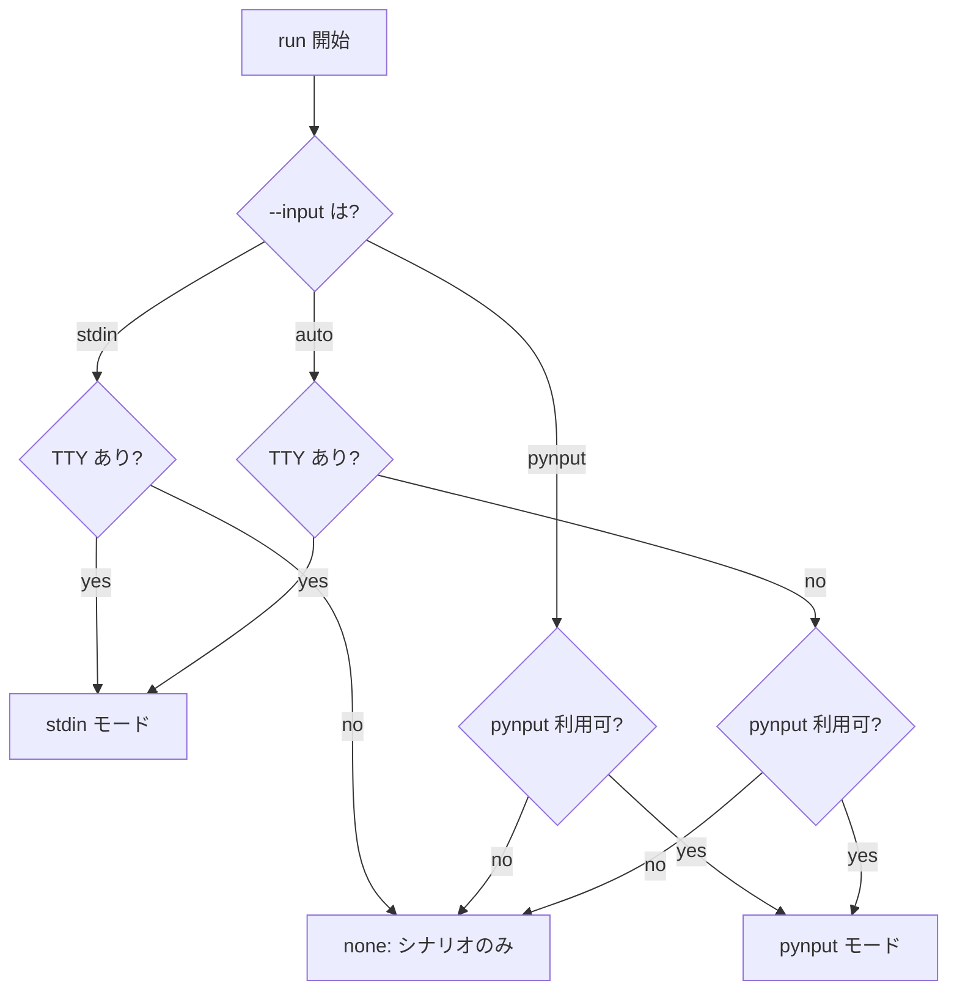
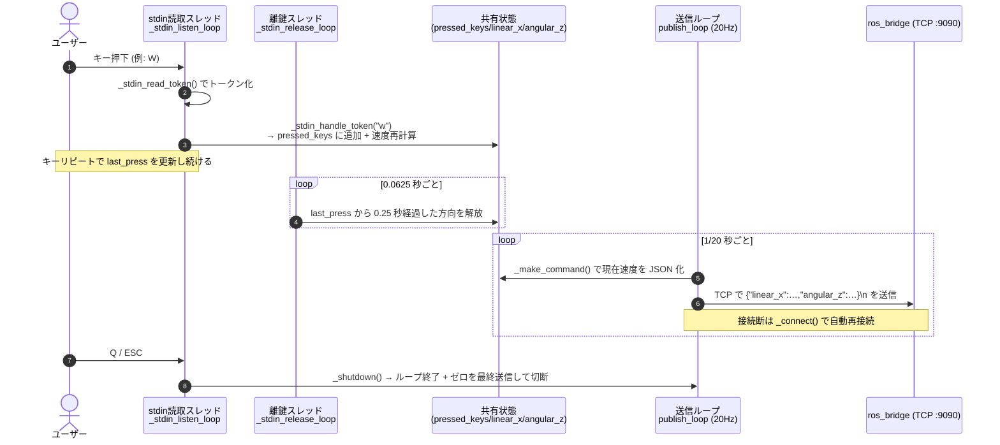
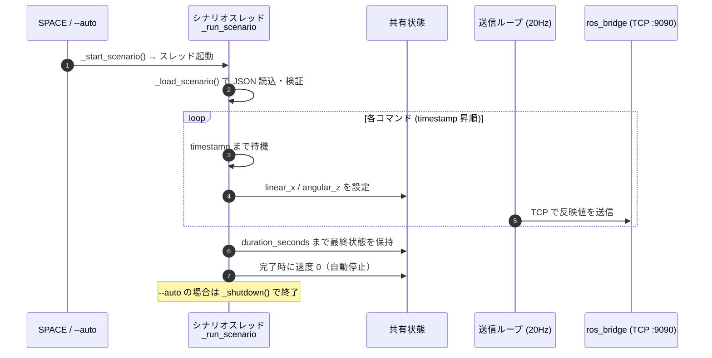

# Keyboard Controller（キーボード操作・TCP クライアント）

キーボード入力（または記録済み JSON シナリオ）を `{"linear_x":…,"angular_z":…}` の
**JSON Lines** に変換し、TCP で `ros_bridge` へ **20 Hz** 送信するクライアントです。
**ROS を一切使いません**（rclpy 非依存）。`ros_bridge` がこれを `geometry_msgs/msg/Twist`
として `/cmd_vel` に再発行します。将来の SoftPLC もこれと同じ TCP 経路に載ります。

入力バックエンドは 2 系統あり、環境に応じて自動選択されます。

- **stdin (termios)** — 表示バックエンド不要。**コンテナ内・SSH 越し・任意の TTY**
  で動作。Docker でのライブ操作の主役。
- **pynput** — 表示バックエンド（X / Quartz / Win32）が使えるネイティブ実行時のフォールバック。

| 項目 | 値 |
|------|----|
| 送信先 | `ros_bridge` TCP（既定 `localhost:9090` / env `BRIDGE_HOST`,`BRIDGE_PORT`） |
| ワイヤ形式 | JSON Lines `{"linear_x":…,"angular_z":…}\n` |
| 送信レート | 20 Hz |

---

## キーバインド

| キー | 動作 |
|------|------|
| `W` / `↑` | `linear.x = +max_speed`（前進） |
| `S` / `↓` | `linear.x = -max_speed`（後退） |
| `A` / `←` | `angular.z = +max_speed`（左旋回 / CCW, REP-103） |
| `D` / `→` | `angular.z = -max_speed`（右旋回 / CW） |
| `+` / `=` | 速度スケール **上げ**（`max_speed *= 1.1`） |
| `-` / `_` | 速度スケール **下げ**（`max_speed /= 1.1`） |
| `SPACE` | JSON シナリオを再生 |
| `R` | 速度を 0 にリセット |
| `Q` / `ESC` | 終了 |

反対キーは相殺されます（例: `W`+`S` → `linear.x = 0`）。内部の `pressed_keys` 集合で
**同時押し**を扱うため、前進しながら旋回（例: `W`+`A`）も可能です。

> **stdin モードの注意:** stdin には OS レベルの「離鍵」イベントがありません。
> そのため最後の入力から `STDIN_KEY_HOLD_SECONDS`（0.25 秒）経過で「離鍵」と
> みなします。**キーを押し続ければ前進し続けます**（OS のキーリピートに依存）。

---

## 入力モードの選択ロジック

`--input {auto,stdin,pynput}`（既定 `auto`）。`auto` は次の優先順で決定します。



---

## シーケンス図

### ① ライブ操作（stdin モード）

`run()` が 2 つのバックグラウンドスレッド（入力読み取り＋離鍵タイムアウト）を起動し、
メインスレッドは 20 Hz の発行ループに入ります。各スレッドは `_state_lock` で保護された
共有状態（`pressed_keys`, `linear_x`, `angular_z`）を更新/参照します。



### ② シナリオ再生

`SPACE` 押下（または `--auto`）で `_run_scenario` が別スレッドで起動し、
タイムスタンプ順にコマンドを適用します。発行ループは①と同じく状態を 20 Hz で流します。



---

## 関数リファレンス

### `KeyboardController` クラス

#### `__init__(...)`
状態を初期化します。`dry_run` でなければ送信ループが `ros_bridge` へ TCP 接続します
（接続は遅延・自動再接続）。

| 引数 | 型 | 既定値 | 説明 |
|------|----|--------|------|
| `scenario_path` | str | None | 再生する JSON シナリオのパス |
| `auto` | bool | False | 起動時に自動再生し、完了後に終了 |
| `ignore_keys_during_scenario` | bool | True | シナリオ再生中は手動移動キーを無視 |
| `dry_run` | bool | False | TCP 接続せずに動作（ローカル/ヘッドレステスト用） |
| `input_mode` | str | "auto" | `auto` / `stdin` / `pynput` |
| `bridge_host` | str | env or `localhost` | `ros_bridge` の TCP ホスト |
| `bridge_port` | int | env or `9090` | `ros_bridge` の TCP ポート |

#### 速度ヘルパー

| 関数 | 引数 | 説明 |
|------|------|------|
| `_recompute_velocity()` | なし | `pressed_keys` から `linear_x` / `angular_z` を再計算（反対方向は相殺） |
| `_reset()` | なし | 押下キーと速度をすべて 0 にクリア |
| `_print_state()` | なし | `📊 linear.x=… angular.z=… (max_speed=…)` を表示 |

#### キーマッピング

| 関数 | 引数 | 説明 |
|------|------|------|
| `_key_to_char(key)` | pynput key | pynput のキーを正規化した小文字 1 文字に変換（なければ None）。`@staticmethod` |
| `_direction_for_key(key)` | pynput key | キーを移動方向名（`forward/backward/left/right`）に対応付け |

#### pynput コールバック

| 関数 | 引数 | 説明 |
|------|------|------|
| `on_press(key)` | pynput key | 押下時。移動・速度スケール・リセット・シナリオ・終了を処理。終了時は `False` を返してリスナー停止 |
| `on_release(key)` | pynput key | 離鍵時。該当方向を `pressed_keys` から外して速度再計算 |
| `_is_quit_key(key)` | pynput key | `Q`/`ESC` かどうか。`@staticmethod` |

#### stdin リスナー（表示不要・コンテナ対応）

| 関数 | 引数 | 説明 |
|------|------|------|
| `_stdin_direction(token)` | str | stdin トークン（1 文字 or `UP/DOWN/LEFT/RIGHT`）を方向名に変換。`@staticmethod` |
| `_stdin_read_token()` | なし | stdin から論理キー 1 つを読む。ANSI 矢印（CSI）を展開。POSIX は `select`、Windows は `msvcrt`。最大 ~50 ms ブロック |
| `_stdin_handle_token(token)` | str/None | トークンを pynput と同じ状態機械へ流す。終了キーなら `False` を返す |
| `_stdin_listen_loop()` | なし | 入力スレッド本体。端末を cbreak に設定し、終了時に termios 設定を復元 |
| `_stdin_release_loop()` | なし | 離鍵スレッド本体。最後の押下から `STDIN_KEY_HOLD_SECONDS` 超過で方向を解放 |

#### シナリオ再生

| 関数 | 引数 | 説明 |
|------|------|------|
| `_load_scenario()` | なし | JSON を読み込み・検証（`commands` リストの有無）。失敗時 None |
| `_start_scenario()` | なし | 再生スレッドを起動（多重起動は防止） |
| `_run_scenario(scenario)` | dict | `timestamp` 昇順にコマンドを適用し、`duration_seconds` まで保持後に自動停止 |
| `_stopping()` | なし | シャットダウン要求を検知してループ中断に使う |

#### TCP 送信・ライフサイクル

| 関数 | 引数 | 説明 |
|------|------|------|
| `_make_command()` | なし | 現在速度を `{"linear_x":…,"angular_z":…}\n` の JSON Lines（bytes）に変換 |
| `_connect()` | なし | `ros_bridge` へ 1 回 TCP 接続を試行（`self._sock` を設定／失敗時 None） |
| `_close_sock()` | なし | ソケットを閉じる |
| `publish_loop()` | なし | 20 Hz で JSON を TCP 送信。未接続なら再接続、断は自動再接続。終了時にゼロを最終送信。dry-run 時はアイドル |
| `_shutdown()` | なし | 多重防止つき終了処理（リスナー停止。ソケットは送信ループ終了時に閉じる） |
| `run()` | なし | エントリ。入力モードを決定 → 該当スレッド起動 → `publish_loop()` |
| `_resolve_input_mode()` | なし | `--input` と利用可否から `stdin`/`pynput`/`none` を決定 |

---

### CLI 用関数

#### `parse_args(argv=None)`
コマンドライン引数を解釈。未知引数は警告します。

| 引数（CLI） | 既定値 | 説明 |
|-------------|--------|------|
| `--scenario FILE` | None | 再生する JSON シナリオのパス |
| `--auto` | （フラグ） | 起動時に自動再生し、完了後に終了 |
| `--allow-keys-during-scenario` | （フラグ） | シナリオ中も手動キーを有効化 |
| `--input {auto,stdin,pynput}` | auto | ライブ入力バックエンドの選択 |
| `--bridge-host HOST` | env `BRIDGE_HOST` or `localhost` | `ros_bridge` の TCP ホスト |
| `--bridge-port PORT` | env `BRIDGE_PORT` or `9090` | `ros_bridge` の TCP ポート |
| `--dry-run` | （フラグ） | TCP 接続せずに起動 |

#### `main(argv=None)`
`parse_args()` → `KeyboardController(...)` 構築 → `run()` を呼ぶエントリポイント。

---

## 使い方

### 手動操作

```bash
# 通常起動（ros_bridge へ TCP 接続。既定 localhost:9090）
python3 keyboard_input_controller.py

# 送信先ブリッジを指定
python3 keyboard_input_controller.py --bridge-host ros_bridge --bridge-port 9090
# 環境変数でも可: BRIDGE_HOST / BRIDGE_PORT

# 入力モードを明示
python3 keyboard_input_controller.py --input stdin
python3 keyboard_input_controller.py --input pynput
```

### シナリオ再生

```bash
# シナリオを読み込み、SPACE で再生開始
python3 keyboard_input_controller.py --scenario /scenarios/demo_scenario_01.json

# 起動時に自動再生して終了（CI / 再現デモ向き）
python3 keyboard_input_controller.py --scenario /scenarios/demo_scenario_01.json --auto
```

再生中は既定で手動移動キーを無視します（記録した軌跡を厳密に再現）。
`--allow-keys-during-scenario` で手動キーを有効化できます。`Q`/`ESC` は常に有効。

### 接続なしのローカルテスト

```bash
python3 keyboard_input_controller.py --dry-run
```

`--dry-run` は `ros_bridge` への TCP 接続を省略するため、ブリッジが無くても
どのマシンでもキー処理・シナリオ解析を確認できます。

---

## シナリオファイル形式

```json
{
  "name": "demo_scenario_01",
  "description": "前進・旋回・停止",
  "duration_seconds": 10,
  "commands": [
    {
      "timestamp": 0.0,
      "description": "前進",
      "linear":  {"x": 1.0, "y": 0.0, "z": 0.0},
      "angular": {"x": 0.0, "y": 0.0, "z": 0.0}
    }
  ]
}
```

- `commands` は `timestamp`（再生開始からの秒）昇順で、指定時刻に適用されます。
- 最後のコマンド後は `duration_seconds` まで最終状態を保持し、その後ロボットを
  自動停止します。

---

## テスト

stdin のトークン処理・離鍵タイムアウト等はヘッドレス単体テストで検証します。

```bash
python3 -m unittest discover -s keyboard_input/tests
```

### 結合での確認手順

1. バックエンドサービス（`ros_bridge` ほか）を起動
   （`run_keyboard.sh` / `.ps1` または `docker compose up -d ros_bridge control_logic gazebo`）。
2. 別端末で `/cmd_vel`（`ros_bridge` が発行）を観測:
   ```bash
   ros2 topic echo /cmd_vel        # Twist メッセージを確認
   ros2 topic hz   /cmd_vel        # ~20 Hz を確認
   ```
   キーボードを介さず TCP 経路だけ確認するなら:
   ```bash
   printf '{"linear_x":1.0,"angular_z":0.5}\n' | nc localhost 9090
   ```
3. **手動キー:** `W`/`A`/`S`/`D` を押し、echo 出力と `📊` デバッグ行で
   `linear.x` / `angular.z` が変化するか確認。
4. **シナリオ:** `--scenario ... --auto` で実行し、`[T.TTs] ...` ログと対応する
   `/cmd_vel` 値、最後の停止を確認。
5. **クロスプラットフォーム:** macOS / Windows（`run_keyboard.ps1`）/ Linux
   （`run_keyboard.sh`）で確認。コンテナ内では stdin モードが選択されます。
   pynput を使うネイティブ実行では、macOS はアクセシビリティ権限、Linux は
   X サーバ / `python3-xlib` が必要です。

## Docker での注意

キー入力には実 TTY/stdin が必要です。コンテナは `-it`（または docker-compose の
`stdin_open: true` + `tty: true`）で起動してください。コンテナ内では表示が無くても
**stdin モード**で操作できます（pynput は表示バックエンドが無いと使えません）。
