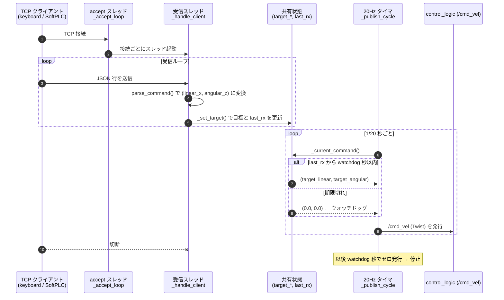

# ROS Bridge（TCP → ROS 2 ブリッジノード）

TCP 上の **JSON Lines** で受け取った速度コマンドを、`geometry_msgs/msg/Twist` として
`/cmd_vel`（DDS）へ再発行するノードです。これにより**コマンド送信元を ROS 2 から
完全に分離**します。現状は `keyboard_controller`、将来は **SoftPLC**（や任意の
TCP 対応ゲートウェイ）が、ROS を一切意識せず TCP だけでロボットを駆動できます。

```
SoftPLC / keyboard ──(TCP, JSON Lines)──▶ ros_bridge ──(DDS /cmd_vel)──▶ control_logic ──▶ gazebo
```

- **ノード名:** `ros_bridge`
- **TCP:** `0.0.0.0:9090`（既定、`--port` / 環境変数で変更可）
- **発行（Publish）:** `/cmd_vel` (`geometry_msgs/msg/Twist`)
- **発行レート:** 20 Hz（最後に受信した値を保持して発行）

---

## 通信プロトコル（JSON Lines）

1 行 1 JSON オブジェクト・UTF-8・`\n` 区切り。両フィールドとも省略可（既定 0.0）。

```json
{"linear_x": 1.0, "angular_z": 0.5}
```

ネスト形式（Twist 風）も受理します。

```json
{"linear": {"x": 1.0}, "angular": {"z": 0.5}}
```

`nc` での簡易送信例:

```bash
printf '{"linear_x":1.0,"angular_z":0.5}\n' | nc localhost 9090
```

---

## 安全機構（ウォッチドッグ）

ノードは**最後に受信したコマンドを 20 Hz で発行し続けます**。ただし
`--watchdog` 秒（既定 0.5 秒）以上コマンドが来ない場合は **ゼロ速度を発行**します。
これにより、クライアント（PLC/キーボード）が切断・停止したらロボットが止まります。

## セキュリティ / 入力検証

`ros_bridge` は **無認証・平文**の TCP を受け付けます。到達できれば誰でも速度指令を
注入できるため、**既定でホストの localhost のみ**に公開します（compose の
`BRIDGE_BIND`、`.env.example` 参照）。外部公開時はファイアウォール / VPN / 専用
ネットワークで保護してください。

受信データに対する防御:

- **不正 JSON / 非オブジェクト / 非数値**は破棄。
- **NaN / Infinity を拒否**（`json` は既定で受理するが、下流フィルタを恒久破壊しうる）。
- **行長上限**（`BRIDGE_MAX_LINE_BYTES`、既定 64 KiB）。改行なしの巨大ストリームに
  よるメモリ枯渇 DoS を防止し、超過接続は切断。
- **同時接続数上限**（`BRIDGE_MAX_CLIENTS`、既定 8）。接続フラッドによるスレッド/
  メモリ枯渇を防止。
- パース時の例外（深いネスト由来の `RecursionError` など）でも接続スレッドは落ちず、
  当該行のみスキップ。

なお速度・加速度の上限クリップは下流の `control_logic` が担います（多層防御）。

---

## シーケンス図

TCP 受信スレッド（接続ごと）が共有状態（最新の目標速度＋受信時刻）を更新し、
20 Hz のタイマがウォッチドッグを適用して `/cmd_vel` を発行します。



---

## 関数リファレンス

### モジュール関数

#### `parse_command(line)` ★中核
1 行のワイヤデータを `(linear_x, angular_z)` に変換します。ROS 非依存の純関数で、
**単体テスト**で契約を固定しています。

| 引数 | 型 | 説明 |
|------|----|------|
| `line` | str / bytes | 1 行の JSON（前後空白・改行は除去。bytes は UTF-8 デコード） |

**戻り値:** `(float, float)` のタプル。空行・不正 JSON・非オブジェクト・非数値・
既知フィールド無しの場合は `None`。flat 形式（`linear_x`/`angular_z`）と nested 形式
（`linear.x`/`angular.z`）の両方に対応。

---

### `RosBridge` クラス

#### `__init__(port, rate_hz, watchdog_s, dry_run)`
状態を初期化し、`dry_run` でなければ ROS 2 ノードとパブリッシャを構築します。

| 引数 | 型 | 既定値 | 説明 |
|------|----|--------|------|
| `port` | int | 9090 | TCP 待ち受けポート |
| `rate_hz` | float | 20.0 | `/cmd_vel` 発行レート [Hz] |
| `watchdog_s` | float | 0.5 | 無通信でゼロ発行に切り替えるまでの秒数 |
| `dry_run` | bool | False | ROS なしで TCP サーバのみ動作（テスト用） |

#### コマンド状態

| 関数 | 引数 | 説明 |
|------|------|------|
| `_set_target(linear_x, angular_z)` | float, float | 目標速度と受信時刻 `last_rx` をロック下で更新 |
| `_current_command()` | なし | ウォッチドッグを適用し、今発行すべき `(linear, angular)` を返す |

#### TCP サーバ

| 関数 | 引数 | 説明 |
|------|------|------|
| `_handle_client(conn, addr)` | socket, addr | 接続ごとのスレッド本体。受信バッファを改行で分割し `parse_command` → `_set_target` |
| `_accept_loop()` | なし | accept ループ。接続ごとに `_handle_client` スレッドを起動 |
| `_start_server()` | なし | リスニングソケットを生成し accept スレッドを開始 |
| `_close_server()` | なし | リスニングソケットを閉じる |

#### 発行・ライフサイクル

| 関数 | 引数 | 説明 |
|------|------|------|
| `_publish_cycle()` | なし | 20 Hz タイマのコールバック。`_current_command()` → `Twist` 発行 |
| `serve()` | なし | サーバ起動 → タイマ生成 → `rclpy.spin()`。終了時にゼロを発行しノードを破棄 |

---

### CLI 用関数

#### `parse_args(argv=None)`
引数を解釈。`--ros-args ...` を除去してから解釈し、未知引数は警告。

| 引数（CLI） | 既定値 | 説明 |
|-------------|--------|------|
| `--port` | 9090 | TCP 待ち受けポート |
| `--rate` | 20.0 | 発行レート [Hz] |
| `--watchdog` | 0.5 | 無通信でゼロ発行に切り替える秒数 |
| `--dry-run` | （フラグ） | ROS なしで TCP サーバのみ起動 |

#### `main(argv=None)`
`parse_args()` → `RosBridge(...)` 構築 → `serve()` を呼ぶエントリポイント。

---

## 使い方

```bash
# 通常起動（既定 :9090）
python3 ros_bridge.py

# ポート・レート・ウォッチドッグを変更
python3 ros_bridge.py --port 9090 --rate 20 --watchdog 0.5

# ROS なしで TCP サーバだけ起動（プロトコル確認用）
python3 ros_bridge.py --dry-run
```

## 動作確認

```bash
# 1) ブリッジへ TCP 送信
printf '{"linear_x":1.0,"angular_z":0.5}\n' | nc localhost 9090

# 2) /cmd_vel に出ているか（別端末・ROS 2 環境）
ros2 topic echo /cmd_vel
ros2 topic hz   /cmd_vel     # ~20 Hz

# 送信を止めると watchdog 秒後に linear.x=0 / angular.z=0 になることを確認
```

## 単体テスト

`parse_command()` とウォッチドッグをヘッドレス（ROS 不要）で検証します。

```bash
python3 -m unittest discover -s ros_bridge/tests
```
